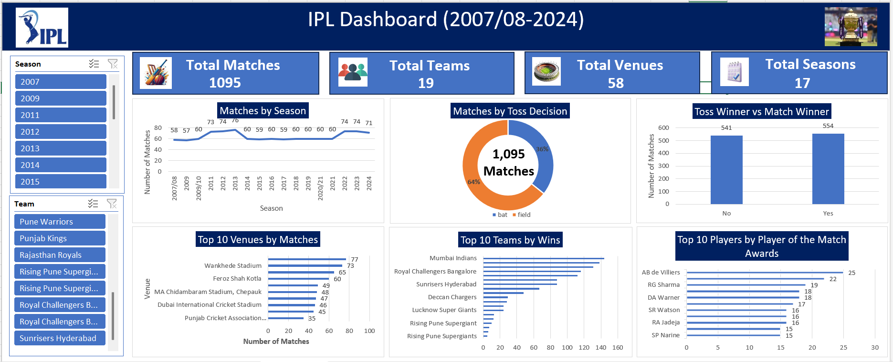

# IPL Data Analytics Dashboard

## About the Project

This project presents an interactive IPL Data Analytics Dashboard created using Microsoft Excel.

## Dashboard Features

- Total Matches
- Total Teams
- Total Venues
- Total Seasons
- Matches by Season
- Matches by Toss Decision
- Toss Winner vs Match Winner
- Top 10 Venues by Matches
- Top 10 Teams by Wins
- Top 10 Players by Player of the Match Awards

## Tools Used

- Microsoft Excel
- Pivot Tables
- Pivot Charts
- Slicers
- Data Analysis
- Dashboard Design

## Dashboard Preview

